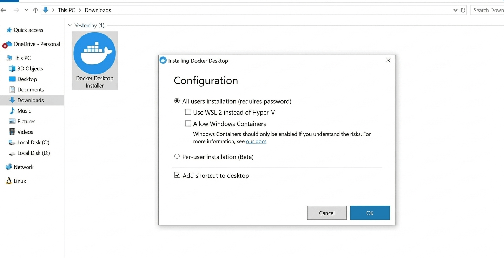

# 🐳 Docker & Infrastructure

This document covers Docker installation, container architecture, and troubleshooting for AuthPanel.

---

## 📌 Installation Requirements

| Requirement              | Link                                                                 |
| :----------------------- | :------------------------------------------------------------------- |
| Docker Desktop           | https://www.docker.com/products/docker-desktop/                     |
| WSL2 (Windows required)  | https://learn.microsoft.com/en-us/windows/wsl/install               |

> **Windows users:** WSL2 is required for Docker Desktop to run Linux containers reliably. Install it before Docker Desktop.

### Install Steps

1. Install WSL2 (Windows only) using the link above
2. Download and install **Docker Desktop**
3. During Docker Desktop setup, enable the WSL2 backend when prompted

   

4. After installation, verify Docker is running:

```bash
docker --version
docker-compose --version
```

---

## 🏗️ Container Architecture

AuthPanel runs three containers orchestrated via `docker-compose`:

| Container | Service  | Description                        |
| :-------- | :------- | :--------------------------------- |
| `app`     | Laravel  | PHP API server                     |
| `client`  | React    | Vite dev server (port 5173)        |
| `db`      | MySQL    | Database                           |

---

## ⚙️ Configuration

Environment variables are managed via `.env` at the project root. Key variables:

| Variable        | Default       | Description              |
| :-------------- | :------------ | :----------------------- |
| `DB_HOST`       | `db`          | MySQL container hostname |
| `DB_DATABASE`   | `laractivate` | Database name            |
| `DB_USERNAME`   | `root`        | Database user            |
| `DB_PASSWORD`   | `secret`      | Database password        |
| `APP_PORT`      | `8000`        | Laravel API port         |
| `CLIENT_PORT`   | `5173`        | Vite frontend port       |

---

## 🛠️ Common Commands

### Start containers (detached, with build)

```bash
docker-compose up -d --build
```

### Stop containers

```bash
docker-compose down
```

### View all container logs (live)

```bash
docker-compose logs -f
```

### View logs for a specific service

```bash
docker-compose logs -f app
docker-compose logs -f client
docker-compose logs -f db
```

### Check container status

```bash
docker-compose ps
```

### Restart a specific service

```bash
docker-compose restart client
```

---

## 🔍 Troubleshooting

### Port already in use

If `8000` or `5173` are occupied, update `APP_PORT` / `CLIENT_PORT` in `.env` and restart containers.

### `docker-compose exec` fails with "no such service"

The container may have exited. Run `docker-compose ps` to check status, then `docker-compose up -d` to bring it back up.

### Database connection refused

Make sure the `db` container is fully started before running migrations. The `app` container has a health check that waits, but if you run commands immediately after `up`, add a small delay:

```bash
docker-compose up -d --build && sleep 5 && docker-compose exec app php artisan migrate --seed
```

### Resetting everything from scratch

```bash
docker-compose down -v   # removes containers AND volumes (wipes the database)
docker-compose up -d --build
docker-compose exec app php artisan migrate --seed
```