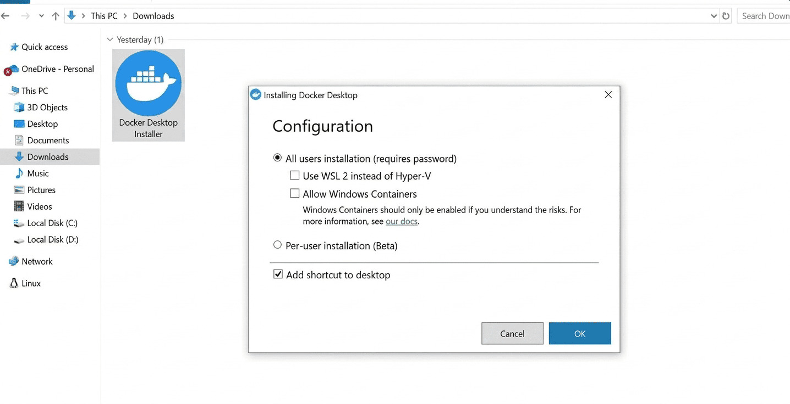

# Docker & Infrastructure

This document covers Docker installation, container architecture, and troubleshooting for Laractivate.

---

## Installation Requirements

| Requirement     | Link                                                            |
| :-------------- | :-------------------------------------------------------------- |
| Docker Desktop  | https://www.docker.com/products/docker-desktop/                 |
| WSL2 (optional) | https://learn.microsoft.com/en-us/windows/wsl/install           |

> **Windows users:** Docker Desktop works with either **Hyper-V** or **WSL2** as the backend. Both are valid — pick one based on your setup.

### Install Steps

1. Download and install **Docker Desktop**
2. During setup, the installer will show a Configuration screen:

   

   - **Hyper-V (default):** Leave "Use WSL 2 instead of Hyper-V" unchecked. No extra setup needed.
   - **WSL2 (optional):** Check "Use WSL 2 instead of Hyper-V" — requires WSL2 to be installed first via the link above.

3. After installation, verify Docker is running:

```bash
docker --version
docker-compose --version
```

---

## Container Architecture

Laractivate runs three containers orchestrated via `docker-compose`:

| Container | Service | Description                  |
| :-------- | :------ | :--------------------------- |
| `app`     | Laravel | PHP API server               |
| `client`  | React   | Vite dev server              |
| `db`      | MySQL   | Database                     |

---

## Configuration

Environment variables are managed via `.env` at the project root.

| Variable        | Default       | Description              |
| :-------------- | :------------ | :----------------------- |
| `DB_HOST`       | `db`          | MySQL container hostname |
| `DB_DATABASE`   | `laractivate` | Database name            |
| `DB_USERNAME`   | `root`        | Database user            |
| `DB_PASSWORD`   | `secret`      | Database password        |
| `APP_PORT`      | `8000`        | Laravel API port         |
| `CLIENT_PORT`   | `5173`        | Vite frontend port       |

> To find your running URLs after setup, check `APP_PORT` and `CLIENT_PORT` in your `.env` — these are the ports your services are bound to.

---

## Common Commands

### Start containers

```bash
docker-compose up -d --build
```

### Stop containers

```bash
docker-compose down
```

### Check container status

```bash
docker-compose ps
```

### View logs

```bash
# All services
docker-compose logs -f

# Specific service
docker-compose logs -f app
docker-compose logs -f client
docker-compose logs -f db
```

### Restart a specific service

```bash
docker-compose restart client
```

---

## Troubleshooting

### Port already in use

Update `APP_PORT` or `CLIENT_PORT` in `.env` to a free port, then restart:

```bash
docker-compose down
docker-compose up -d --build
```

### `docker-compose exec` fails with "no such service"

The container may have exited. Check its status then bring it back up:

```bash
docker-compose ps
docker-compose up -d
```

### Database connection refused

If you run migrations immediately after `up`, the `db` container may not be fully ready. Add a short delay:

```bash
docker-compose up -d --build && sleep 5 && docker-compose exec app php artisan migrate --seed
```

### Reset everything from scratch

```bash
docker-compose down -v        # removes containers AND volumes (wipes the database)
docker-compose up -d --build
docker-compose exec app php artisan migrate --seed
```